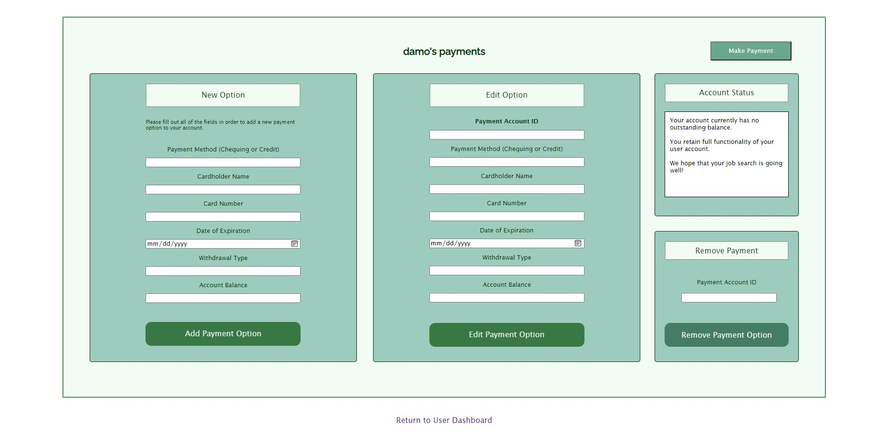

# db-class-website

Website/web application for the main project for our database course.

Built with HTML/CSS/PHP/SQL - WAMP stack, technically - and a very small amount of JavaScript.

************
  OVERVIEW
************

This application is a 'Job Career Portal' that allows employers and users (jobseekers) to post, search, modify, and apply for jobs. Users are able to create or delete their own accounts, in addition to updating their profiles or retrieving their passwords via not-so-secure mechanisms (security is not part of this assignment, heads up). Employers are likewise able to create accounts will all of the same options except for account modification.

An employer can change their subscription category, post jobs, edit already existing job postings, and update applications (including a message that ideally is sent back to the applicant). Additionally, the employer dashboard displays the most recent job application *for that given employer*. The exception here is for administrators, who can access all parts of the system, and will, at a glance, simply see the most recent application *for all job applications sent*.

A user can easily search all jobs, search jobs by category (e.g. IT, Engineering), or search jobs by name (e.g. Web Developer, Barista). All job searches are displayed in a panel on the screen. Users can apply for any job, maintain the status of their application (e.g. make it 'active' or 'inactive'), and withdraw an application that they have already sent. A regular user can upgrade their user category, update their user profile, and "delete" their user account.

Each end user has a payments panel, which allows users to add, update, and remove payments methods. Additionally, users/employers will be shown whether their account is frozen, which is indicative of a negative balance. When a user's account is frozen, the logic is in place such that none of the useful application functionality is accessible to that user.

Finally, from the payments panel, employers and users can navigate to a simple 'payment' screen, whereby a payment will be made. If the account of that given user has a balance that is insufficient, then the query will not be made and the end user will be notified.

**********
  IMAGES
**********

*************************
  REQUIREMENTS COMPLETED  
*************************

- Set up the ssh tunnel at localhost, which is now fairly easy to use.
- Styling for the sign-up form is likely complete. Might tweak it a bit more.
- A 'Project Overview' document has been provided to provide reasonable assumptions and describe the functionality of the application.
- ER diagram and high-level schema are virtually complete.
- The UI (dashboard) for 'Employer' is basically complete, apart from minor changes.
- The UI (dashboard) for 'User' is also basically complete, apart from bits of tweaking.
- The UIs for payments for 'Employer' and 'User' have been created.
- 'Create New Account' page has been completed for employer.
- 'Create New Account' page has been completed for user.
- Login validation for user/employer mostly complete, including validating by user category.
- 'Password Retrieval' pages created for user/employer, admin can function on both.
- 'Current Application Summary' PHP successfully added/fully functional.
- Added new attributes to the 'job_application' SQL and removed the ability to submit more than one application per job. User views have been updated accordingly.
- 'Current Application Summary' improved to restrict the most recent application as dependant on whether the session is running for an admin or an employer. In case of employer, it will take the most recently submitted application for all applications submitted to that employer.
- 'Post Job' PHP successfully added/fully functional. Should be tweaked to automatically include the ID of the current user (employer) running their session.
- 'Update Job' PHP is almost completely done, except for an issue where the previous date needs to be maintained upon new insertions.
- 'Update Application' PHP is basically complete. As with the other ones, I still have to add some form of message printed to the user if data is incomplete.
- 'Jobs Posted By Employer' (history) added to the employer dashboard.
- 'Applications Received By Employer' (history) added to the employer dashboard.
- 'Applications Accepted By Employer' (history) added to the employer dashboard.
- 'Maintain User Status' section has been completed and is functional. Allows changing a user/employer's status only if current session user is admin.
- 'Upgrade Category' for employers is finished, and is fully functional
- 'Search All Jobs' is complete, fully functional.
- 'Upgrade User Category' and 'Update User Profile' have been completed, apart from a bit of sanitization perhaps.
- 'Search Jobs By Category' and 'Search Jobs By Name' have been implemented.
- 'Apply for a Job' is now fully implemented for users.
- 'Update Application Status', 'Withdraw Application', and 'Delete User Account' have been implemented.
- 'User Applications Sent' (history) added to the user dashboard.
- 'User Applications Accepted' (history) added to the user dashboard.
- 'User Applications Rejected' (history) added to the user dashboard.
- 'Add Payment Option' for both employers and users.
- Logic to ensure that 'frozen' accounts do not have access to dashboard services (except for editing the account, in the case of 'user', and viewing history for employer/user)
- 'Edit Option' for payments added.
- 'Remove Payment' option added.
- 'Account Status' output for settled accounts/frozen accounts.
- 'Make Payment' for employers and users. Logic to check account balance.
- Added alerts for successful/failed insertions.
